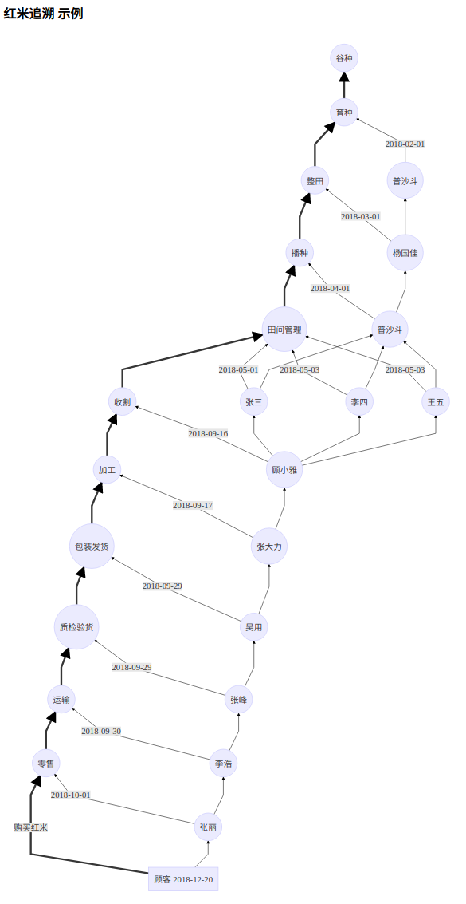

# SDAG 用于溯源

sdagtrack.js 是建立在sdag.js基础之上，对上链功能进行的友好封装。开发者可以基于 sdagtrack.js 构建一切与溯源有关的应用。

### 使用方法

首先引用：

```
const track = require ("sdagtrack.js");
```

然后设置hub：

```
track.set_hub("wss://10.168.1.132:6615");
```

设置助记词：

```
track.set_mnemonic("fade aunt crack express uncle fit valley faculty candy toddler buzz pink");
```

查看地址:

得到该助记词对应的唯一地址（用于和KYC系统中进行数字身份核对）
```
const address = track.get_address();
```

上链，并验证父单元为"NuVw+sk/k/q4LpkScjJ6VXWYQDlsVe1hb6/SeUv6wyk="的哈希：

```
track.text("田间管理","NuVw+sk/k/q4LpkScjJ6VXWYQDlsVe1hb6/SeUv6wyk=").then((unit_hash)=>{
    //上链后，得到一个单元哈希，用作追溯的上一环节。
    console.log(unit_hash);
    //把unit_hash保存在本地，留作未来查询之用。其他环节，可以上链并验证该单元哈希。
});
```

最后，这是一个简单的农产品溯源流程图。SDAG可以为每个农产品设立唯一标识，每一环节都进行存证（上链）。



开发者可以根据unit进行取证查询：

```
//取证、查询
track.find("NuVw+sk/k/q4LpkScjJ6VXWYQDlsVe1hb6/SeUv6wyk=").then((parents,childrens)=>{
    //找到"NuVw+sk/k/q4LpkScjJ6VXWYQDlsVe1hb6/SeUv6wyk="的父单元 （数组）
    console.log(parents);
    //找到"NuVw+sk/k/q4LpkScjJ6VXWYQDlsVe1hb6/SeUv6wyk="的子单元 （数组）
    console.log(childrens);
});
```

